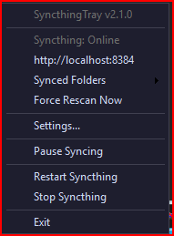
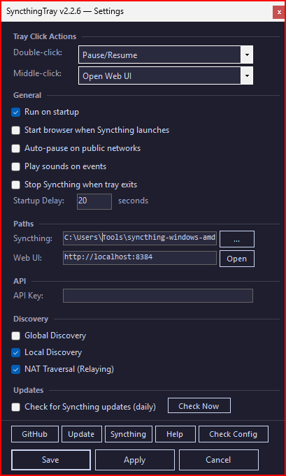
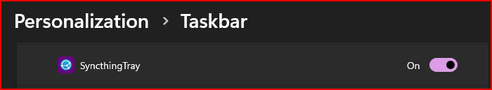

# SyncthingTray

*LTR — Long-Term Release · one-click self-update built in.*

A lightweight system tray manager for [Syncthing](https://syncthing.net/) on Windows, built with C# (.NET 8 WinForms).

## Screenshots

| Tray Menu | Settings | Taskbar |
|:---------:|:--------:|:-------:|
|  |  |  |

## Features

- Launches Syncthing hidden (no console window)
- Tray icon shows running state (sync/pause icons) with dark-themed context menu
- Start, stop, and restart Syncthing from the tray menu
- Pause/resume syncing via menu or middle-click
- Open the Syncthing Web UI with a double-click
- Synced Folders submenu — open any synced folder in Explorer
- Device connect/disconnect notifications
- File conflict (pull error) detection
- Network auto-pause on public networks (WMI-based)
- Auto-update check for Syncthing (daily, rate-limited)
- Dark-themed Settings GUI with discovery toggles
- Config check utility (validates exe, process, API, discovery)
- Help window with usage guide
- Graceful shutdown via Syncthing REST API with process kill fallback
- Crash detection with audible alert when Syncthing exits unexpectedly
- Run at Windows startup (shortcut in Startup folder)
- Portable mode — auto-detected on removable drives (disables startup shortcut)
- First-run wizard — auto-opens Settings when no config exists
- Overclick safeguard — cooldown on rapid Start/Stop/Restart/Pause actions
- Single-instance enforcement — kills previous instances on launch
- Tray icon recovery after Explorer restarts

## Download

Grab the latest from the [Releases](https://github.com/itsnateai/synctray/releases) page:

- **`SyncthingTray.exe`** — self-contained, no .NET runtime needed (~147 MB)

### WinGet

```powershell
winget install itsnateai.SyncthingTray
```

WinGet installs stay current automatically — use `winget upgrade itsnateai.SyncthingTray`. The in-app self-update button detects WinGet installs and points you back at the CLI instead of trying to overwrite the managed binary.

### Self-update integrity

Releases publish a `SHA256SUMS` file alongside the exe. The in-app **Update** button downloads it, verifies the hash, and fails closed if anything is missing or doesn't match. Unverified updates never land on disk.

## Requirements

- Windows 10/11
- [Syncthing](https://github.com/syncthing/syncthing/releases) — download `syncthing-windows-amd64-*.zip` and extract `syncthing.exe`

> **Note:** This is a lightweight alternative to [Syncthing Tray](https://github.com/Martchus/syncthingtray) (Qt-based, ~80 MB). SyncthingTray focuses on simplicity — just tray management, no built-in file browser or embedded web view.

## Setup

1. Download `SyncthingTray.exe` from [Releases](https://github.com/itsnateai/synctray/releases)
2. Download [Syncthing](https://github.com/syncthing/syncthing/releases) and extract `syncthing.exe` to the same folder
3. Run `SyncthingTray.exe` — Syncthing starts automatically in the background
4. Right-click the tray icon > **Settings** to enter your API key

## Configuration

Right-click the tray icon and select **Settings** to configure:

- **Double-click action** — configurable: Open Web UI, Force Rescan, Pause/Resume, or Do Nothing
- **Middle-click action** — configurable: same options as double-click
- **Run on startup** — creates/removes a Windows Startup shortcut
- **Start browser** — open the Web UI when Syncthing launches
- **Sound notifications** — play sounds on device connect/disconnect, file errors, unexpected stop
- **Auto-pause on public networks** — pause syncing on public Wi-Fi
- **Startup delay** — wait N seconds before launching Syncthing
- **Syncthing path** — custom path to `syncthing.exe`
- **Web UI URL** — custom Syncthing Web UI address
- **API Key** — required for pause/resume, status polling, and graceful shutdown. Find it in the Syncthing Web UI under Actions > Settings > API Key.
- **Discovery** — toggle Global Discovery, Local Discovery, and NAT Traversal
- **Auto-update** — check for Syncthing updates daily

Settings are saved to `SyncthingTray.ini` in the application directory.

## Diagnostics

Diagnostic logging is **off by default**. To enable it, add `DiagnosticLogging=1` to `SyncthingTray.ini`. When enabled, a rolling log is written to `%LOCALAPPDATA%\SyncthingTray\tray.log` (1 MB cap, one-generation rotation to `.1`) — attach this file to any bug report.

## Uninstall

1. Right-click the tray icon → **Exit**
2. Delete `SyncthingTray.exe` and `SyncthingTray.ini`
3. Delete `%APPDATA%\Microsoft\Windows\Start Menu\Programs\Startup\SyncthingTray.lnk` if you enabled "Run on startup"
4. Delete `%LOCALAPPDATA%\SyncthingTray\` (contains the diagnostic log and update sentinel)
5. If installed via WinGet: `winget uninstall itsnateai.SyncthingTray`

Syncthing itself is separate — uninstall it via whatever method you used to install it.

## Building from Source

Requires [.NET 8 SDK](https://dotnet.microsoft.com/download/dotnet/8.0).

```bash
dotnet build -c Release
dotnet test
```

### Publish as single-file .exe

```bash
dotnet publish SyncthingTray/SyncthingTray.csproj -c Release -r win-x64 --self-contained true -p:PublishSingleFile=true
```

Output: `SyncthingTray/bin/Release/net8.0-windows/win-x64/publish/SyncthingTray.exe`

## Supporting This Project

This app is free and open source. If it saves you time, consider supporting continued development:

<p>
  <a href="https://buymeacoffee.com/itsnate"></a>
</p>

- **[Buy Me a Coffee](https://buymeacoffee.com/itsnate)** — one-time support

You can also build from source for free — see the build instructions above.

---

## License

MIT
